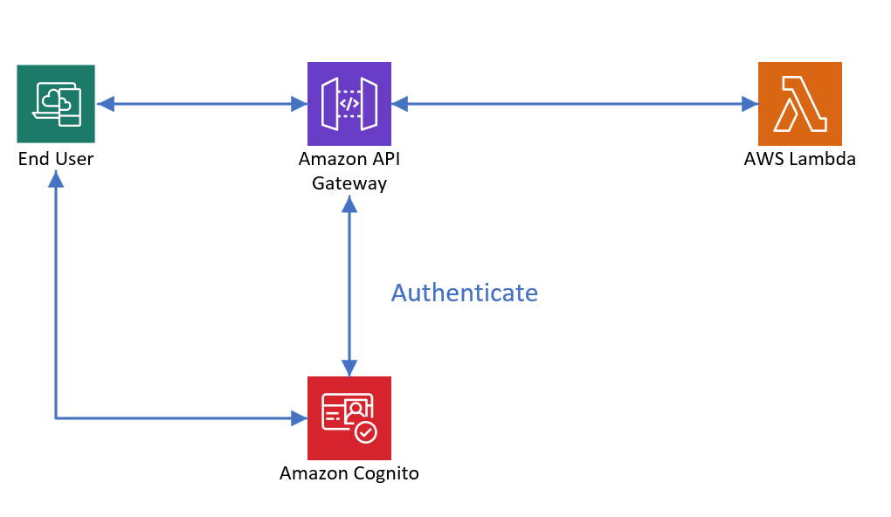
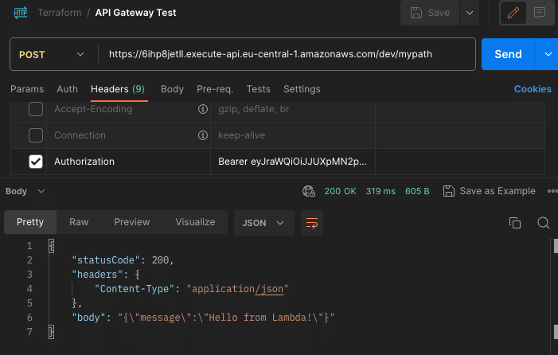

## Getting Started

### Diagram AWS


### Terraform
```
terraform init
terraform plan -out demo
terraform apply demo

```

### Ingress Controller Install
```
kubectl apply -f https://raw.githubusercontent.com/kubernetes/ingress-nginx/controller-v1.10.0/deploy/static/provider/aws/deploy.yaml
```

Download the deploy.yaml template
```
wget https://raw.githubusercontent.com/kubernetes/ingress-nginx/controller-v1.10.0/deploy/static/provider/aws/nlb-with-tls-termination/deploy.yaml
```
Edit the file and change the VPC CIDR in use for the Kubernetes cluster:
```
proxy-real-ip-cidr: XXX.XXX.XXX/XX
```
Change the AWS Certificate Manager (ACM) ID as well:

```
arn:aws:acm:us-west-2:XXXXXXXX:certificate/XXXXXX-XXXXXXX-XXXXXXX-XXXXXXXX
```

Deploy the manifest:

```kubectl apply -f deploy.yaml```

### Jenkins Pipeline
#### Note: There are 3 modes: ONLY_BUILD, ONLY_DEPLOY, ALL
The main purpose of ONLY_BUILD mode is to only build the source and push the image to ECR before deploying the stage. If we choose the ALL mode, the pipeline will run all stages.

### Helm Chart
The demo-chart will include deployment and service components. Additionally, we can add or enable configmap, secret, hpa, and ingress depending on the specific case.
### Postman and test API

#### Get Token from AWS Cognito

```
aws cognito-idp admin-initiate-auth --user-pool-id <USER_POOL_ID> --client-id <CLIENT_ID> --auth-flow ADMIN_NO_SRP_AUTH --auth-parameters USERNAME=phuoclh,PASSWORD=Test@123
```


Create DB and grant permission.

```
CREATE DATABASE `phucninh-blog`

GRANT ALL PRIVILEGES ON `phucninh-blog`.* TO `superuser`@`%`

FLUSH PRIVILEGES;

```